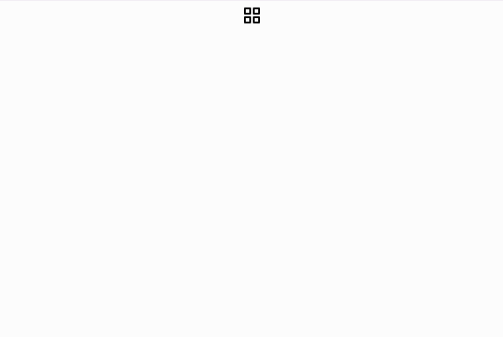
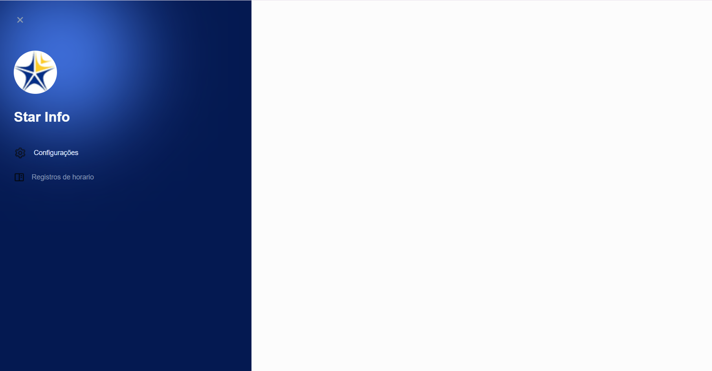
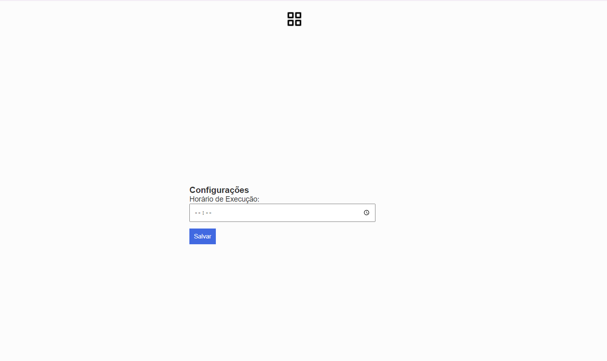
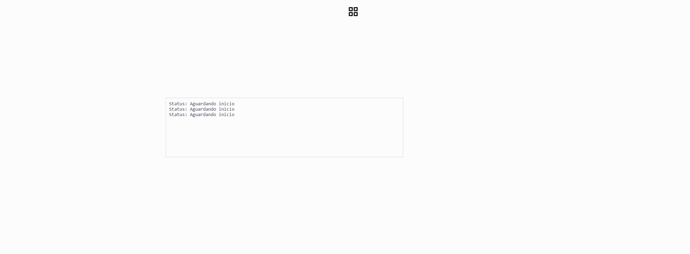

<!-- "# tecwin"  -->

<!--
ORDEM DE EXECUÇÃO MANUAL:
IMPORTNCM
IMPORTST
APIST
APIPIS
APIPISDEB
DADOSST                       
AJUSTAIPI
AJUSTAST
ATUALIZANCM
AJUSTACST
ATUALIZA 
-->
# Integração de Dados Tributarios 
## Descrição

Este projeto tem como objetivo ler arquivos de ncm e st gerados pela WK, adicionar no banco de dados e atualizar com as informações vindas da tecwin para gerar e atualizar para o WK RADAR com informações tributárias da Tecwin. O processo envolve a geração de um arquivo TXT do WK RADAR, mesclagem com dados tributários da Tecwin e importação das informações atualizadas de volta ao WK RADAR para a empresa Plasser.

## Funcionalidades Principais

* Leitura de arquivos de produtos no formato txt.
* Processamento dos produtos para remover caracteres indesejados e ajustar o formato.
* Inserção eficiente de produtos no banco de dados, utilizando inserções em lote (batch insert).
* Tratamento de erros e uso de logs para monitorar o processo.
* Suporte a operações de reinicialização de tabelas e atualização de status de execução.

## Uso

Ao iniciar a aplicação você poderá agendar um horario para inicio da aplicação, esse horario se repetira todos os dias enquando não for atualizado por algum usuário.
O horário agendado ira se repetir todos os dias e continuara executando.

Ao abrir a aplicação ira para essa tela: 

Ao clicar no botao no centro da pagina abrira um menu de navegação lateral, em que podera escolher entre a configuração de horario e os status do serviço rodando :

A tela de configuração voce pode configurar o horario que deseja a aplicação seja executada:

A tela seguinte você pode acompanhar o andamento da aplicação em execução:

## Tecnologias Utilizadas

